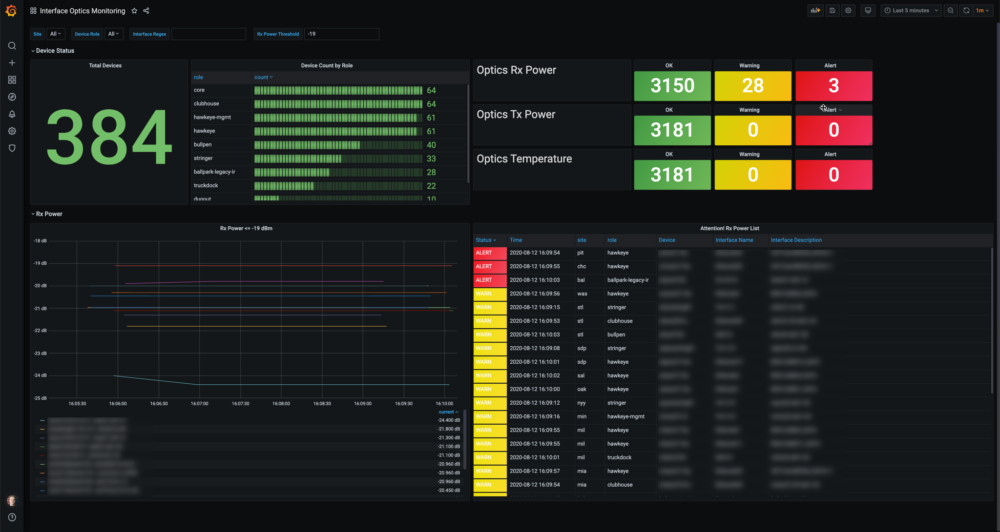

# Optics Health Monitoring

As a network engineer I need to monitor the health of my interface transceiver optics.  I'd
like a dashboard that looks like this:

# Device Support

   * Arista EOS via EAPI
   * Cisco IOS via SSH
   * Cisco NX-OS via NXAPI
  