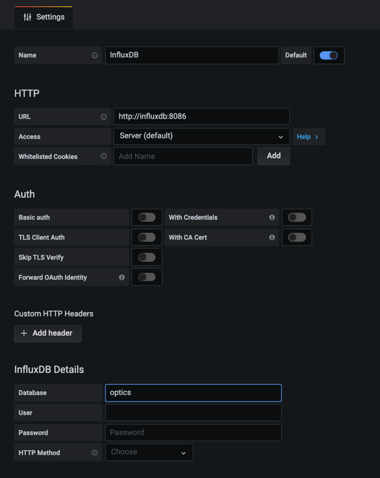
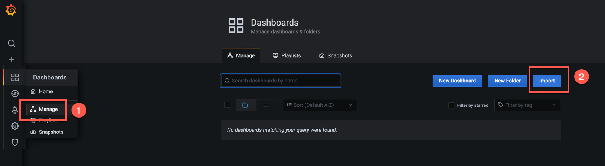
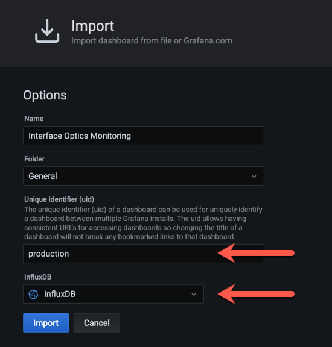
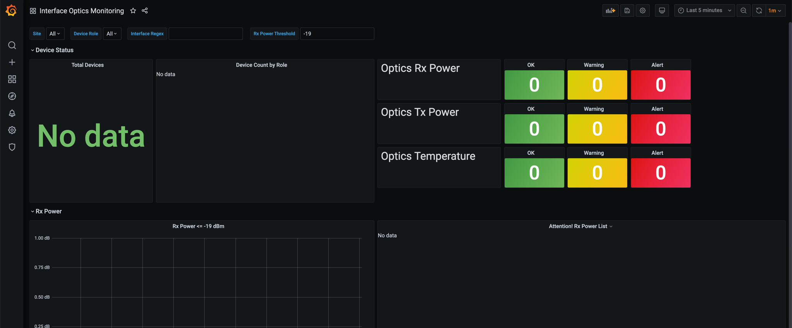

# Sample Deployment

This document describes the process to use the netpaca-optics monitoring in a
full stack that includes [InfluxDB](https://www.influxdata.com/) as the time
series database and [Grafana](https://grafana.com/) for dashboard visualization.

# Before You Begin

You will need a server with [Docker](https://docs.docker.com/get-docker/) and
[Docker-Compose](https://docs.docker.com/compose/install/) installed.  This
sample deployment uses docker-compose v3.7 format, so make sure you are using a
version that supports it.   At the time of this writing these versions were
used:

```shell
$ docker --version
Docker version 19.03.12, build 48a66213fe

$ docker-compose --version
docker-compose version 1.26.2, build eefe0d31
```

## Build the netpaca-optics Docker image

You will need to git clone this repository and then build the Docker image.  If you have
`make` installed on your system you can run the following command in the root directory
where the `Dockerfile` is located:

```
$ make
```

If you do not have make installed then you can run the command:

```
docker build --tag netpaca-optics:0.1.0 .
```

---
**CHANGE DIRECTORIES INTO `sample-deployment`**

---

## Read over `netpaca.toml` Configuration File

Please read through the [netpaca.toml](netpaca.toml) configuration file.  You
will notice a number of envrioment varaibles being referenced.  The
[docker-compose.yml](docker-compose.yml) file will configure some of these.

## Credentials
The credentials are provided via a [credentials.env](credentials.env). You
**MUST** edit the credentials.env file and set the values to your actual
credentials.

## Inventory
You will need to provide an inventory CSV file that defines the `host`,
`ipaddr`, and `os_name` columns at a minimum.  You can add additional columns
and they will present as metric tag-values. For example, if you define a column
called `site`, then your metrics will include the tag `site=<value>`.

You are responsible for building this inventory file.  If you use Netbox, you
can find a python script
[here](https://github.com/netpaca/netpaca/blob/master/examples/netbox_inventory.py).
Otherwise you will need to DIY a script to generate the inventory file that you
want to use.

## Setup your InfluxDB instance

Install InfluxDB from DockerHub:

```
docker pull influxdb
```

Setup the InfluxDB configuration file

```
docker run --rm influxdb influxd config > influxdb.conf
```

Run the initialization setup script:

```
docker run --rm \
  -e INFLUXDB_ADMIN_USER=admin -e INFLUXDB_ADMIN_PASSWORD=supersecret \
  -e INFLUXDB_USER=homeassistant -e INFLUXDB_USER_PASSWORD=supersecret \
  -e INFLUXDB_DB=optics \
  -v $PWD:/var/lib/influxdb \
  influxdb /init-influxdb.sh
```

Start the InfluxDB container:

```
docker-compose up -d influxdb
```

The `netpaca.toml` file is configured to use a database with the name `optics`. 
When you setup your InfluxDB system, you will see the same name was used above. 
You should also set a database retention size so you do not fillup your server
filesystem.

```
# get into the influxdb container
server$ docker-compose exec influxdb bash

# now in container, start the influx command interpreter
root@09ab53bb0041:/# influx
Connected to http://localhost:8086 version 1.8.1
InfluxDB shell version: 1.8.1

> CREATE RETENTION POLICY three_days ON optics DURATION 72h REPLICATION 1 DEFAULT
> exit
```

## Setup your Grafana instance

Install the grafana docker instance from DockerHub:

```
docker pull grafana/grafana
```

Start the Grafana container:

```
docker-compose up -d grafana
```

Open a web brower to `http://localhost:3000` and login with the default credentials of
user=admin, password=admin.

Once you've logged into the system you will need to first configure a Datasource to use
the InfluxDB system.  Your settings should look like this:



The next step is to import the Dashboard from the [optics-dashboard.json](optics-dashboard.json) file.

Select the Manage Dashboards option from the left, and the select the Import option:



Next use the file-browser to select the `optics-dashbaord.json` file.  Once loaded you will
see the next dialog where you can change the uid value and select the InfluxDB data source.
You can name the uid anything you want or leave it as provided.



Click the Import button at the bottom, and you should see the dashboard - no data yet, but
that is expected.



## Customize the `docker-compose.yml` file

The sample docker-compose.yml file defines only one collector container that will
pull interface optics from all devices in your inventory:

```yaml
  optics-all:
    << : *default-netpaca
    command: netpaca -C /etc/netpaca/netpaca.toml --log-level debug
```

You will also see additonal services commented out called `opitcs-core` and `optics-noncore`.
These exist to illustrate how you could create multiple collector containers to segement
your inventory into different collector containers. 


# Start the Health Monitoring System

Use docker-compose to bring up all of the collection of docker containers:

```
docker-compose up -d
```

You can now look at the collector logs to ensure everything is working.

```
docker-compose logs -f optics-all
```

You will soon see the dashboard with active data!


# The `netpaca` command

The `netpaca` command is executed in the container image to perform the metric
collection and export process.  For details on this command, please refer to the
[netpaca](https://github.com/netpaca/netpaca) repository documents.
